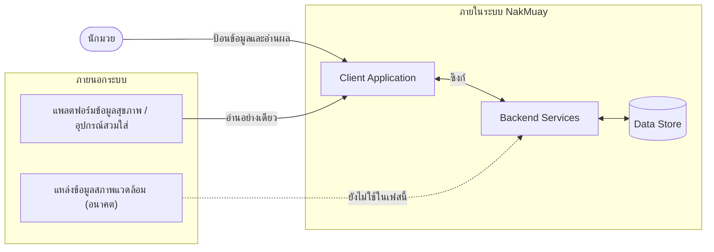
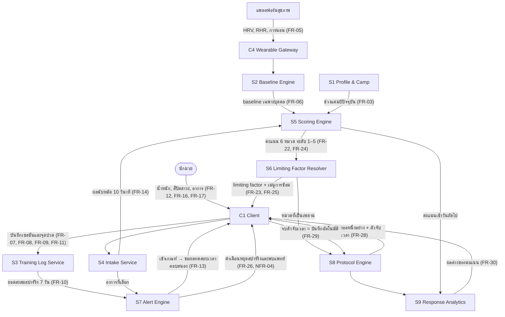
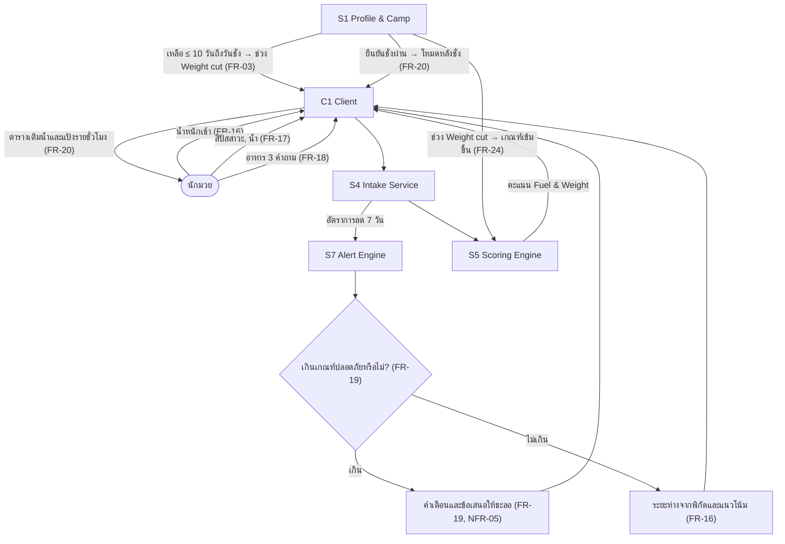
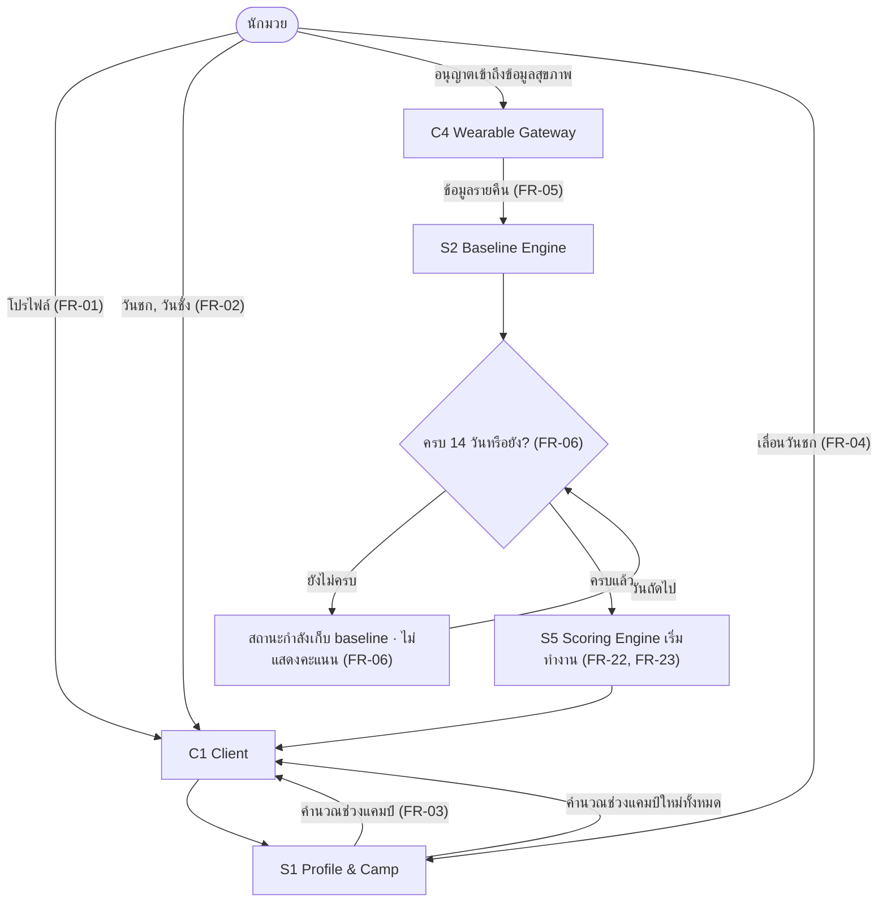

# High Level Architecture — NakMuay

สถาปัตยกรรมระดับ conceptual / logical — **ยังไม่ผูกกับ tech stack ใดๆ**

- ปรับปรุงล่าสุด: 28 สิงหาคม 2569
- แหล่งความจริง: [[feature-list]] · [[user-journey]] · [[backlog]]
- เอกสารปลายทาง: [[api-spec]] · [[db-spec]] · `detailed-design/`
- สถานะ tech stack: [[technology-stack]] **ยังไม่ตัดสินใจ** — เอกสารนี้จึงเรียก component ตามหน้าที่ ไม่ใช่ตามเทคโนโลยี

---

## 1. ขอบเขตของระบบ (System Boundary)

| ประเด็น | การตัดสินใจ |
|---|---|
| ใครอยู่ในระบบ | นักมวยเพียงบทบาทเดียว ([[20260828-01-boxer-recovery-tracking#2.3 บทบาทผู้ใช้\|spec §2.3]]) |
| ข้อมูลจากอุปกรณ์สวมใส่ | **อ่านอย่างเดียว** ระบบไม่เขียนกลับไปยังแพลตฟอร์มสุขภาพ |
| ข้อมูลออกนอกระบบ | เฉพาะเมื่อผู้ใช้สั่งส่งออกเอง ([[backlog\|FR-33]]) ตาม [[backlog\|NFR-03]] |
| บทบาทโค้ช / ระบบสโมสร | อยู่นอกขอบเขตเฟสนี้ — แต่ Data Store ต้องออกแบบเผื่อสิทธิ์การเห็นข้อมูลรายบุคคลไว้ |

---

## 2. Component Inventory

| # | Component | หน้าที่ | ข้อมูลที่ถือครอง | คุยกับใคร | รหัสที่รองรับ |
|---|---|---|---|---|---|
| C1 | **Client Application** | หน้าจอทั้งหมด รับอินพุตจากผู้ใช้ แสดงผลลัพธ์ | สถานะหน้าจอชั่วคราว | C2, C3, S1–S8 | ทุก FR ที่มีหน้าจอ |
| C2 | **Local Store** | เก็บข้อมูลที่บันทึกขณะออฟไลน์ | คิวรายการรอซิงก์ | C1, C3 | [[backlog\|NFR-06]] |
| C3 | **Sync Coordinator** | ส่งคิวขึ้นเมื่อกลับมาออนไลน์ แก้ข้อขัดแย้ง | เครื่องหมายเวลาของการซิงก์ล่าสุด | C2, S1 | [[backlog\|NFR-06]] |
| C4 | **Wearable Gateway** | ดึง HRV ชีพจรขณะพัก และการนอน จากแพลตฟอร์มภายนอก | ข้อมูลดิบรายคืน | ภายนอก, S2 | [[backlog\|FR-05]] |
| S1 | **Profile & Camp Service** | จัดการโปรไฟล์ แคมป์ และคำนวณช่วงแคมป์ปัจจุบัน | โปรไฟล์, แคมป์, ช่วงแคมป์ | D1 | [[backlog\|FR-01]] [[backlog\|FR-02]] [[backlog\|FR-03]] [[backlog\|FR-04]] |
| S2 | **Baseline Engine** | สร้างและปรับค่าอ้างอิงเฉพาะบุคคลจากข้อมูล 14 วัน | baseline ต่อสัญญาณ | D1, C4 | [[backlog\|FR-06]] |
| S3 | **Training Log Service** | รับเซสชันซ้อม 4 สกุลโหลด และคำนวณยอดสะสมสปาร์ริงแยก | เซสชัน, ยอดสะสม 7/28 วัน | D1 | [[backlog\|FR-07]]–[[backlog\|FR-11]] |
| S4 | **Intake Service** | รับน้ำหนัก น้ำ อาหาร อาการ และผลการทดสอบ | รายการบันทึกรายวัน | D1 | [[backlog\|FR-12]]–[[backlog\|FR-18]] [[backlog\|FR-21]] |
| S5 | **Scoring Engine** | คำนวณคะแนน 6 หมวดเป็นระดับ 5 ขั้น โดยเทียบ baseline และปรับตามช่วงแคมป์ | คะแนนรายวันต่อหมวด + ปัจจัยที่ทำให้เปลี่ยน | D1, S1, S2, S3, S4 | [[backlog\|FR-22]] [[backlog\|FR-24]] [[backlog\|NFR-08]] |
| S6 | **Limiting Factor Resolver** | เลือกหมวดต่ำสุดเป็น limiting factor และออกเมนูการซ้อม 4 สกุล | คำตัดสินประจำวัน | S5, S3 | [[backlog\|FR-23]] [[backlog\|FR-25]] |
| S7 | **Alert Engine** | ตรวจเงื่อนไขคำเตือน 3 ชนิด: ศีรษะ · อัตราการลดน้ำหนัก · ซ้อมเกิน | คำเตือนที่เปิดอยู่ | S3, S4, S5 | [[backlog\|FR-19]] [[backlog\|FR-26]] [[backlog\|FR-27]] |
| S8 | **Protocol Engine** | เลือกโปรโตคอลวันละหนึ่งอย่างตาม limiting factor และบันทึกการทำ | โปรโตคอลที่มอบหมาย + สถานะ | S6, D1 | [[backlog\|FR-28]] [[backlog\|FR-29]] |
| S9 | **Response Analytics** | เทียบคะแนนวันถัดไประหว่างวันที่ทำกับวันที่ข้าม | ผลต่างต่อโปรโตคอล | S5, S8 | [[backlog\|FR-30]] [[backlog\|FR-31]] |
| S10 | **Summary & Export** | สรุปรายสัปดาห์ และส่งออกข้อมูลตามช่วงที่ผู้ใช้เลือก | — (อ่านอย่างเดียว) | D1 | [[backlog\|FR-32]] [[backlog\|FR-33]] |
| D1 | **Data Store** | จัดเก็บข้อมูลทั้งหมดแบบเข้ารหัส | ทุก entity ใน [[db-spec]] | ทุก service | [[backlog\|NFR-02]] [[backlog\|NFR-03]] |

> **หลักการแบ่ง component:** แยกตาม *จังหวะการเปลี่ยนแปลงของกฎ* ไม่ใช่ตามหน้าจอ — สูตรคำนวณคะแนน (S5)
> และเกณฑ์คำเตือน (S7) จะถูกปรับบ่อยที่สุดหลังได้ข้อมูลจริง จึงต้องแยกออกจากส่วนที่รับข้อมูลเข้า (S3, S4)

---

## 3. Data Flow ต่อ User Journey

### 3.1 Journey 1 — เช้าหลังวันสปาร์ริงหนัก

อ้างอิง [[user-journey#Journey 1: เช้าหลังวันสปาร์ริงหนัก — ตัดสินใจว่าวันนี้ซ้อมอะไรได้|Journey 1]]

**สิ่งที่ flow นี้บังคับให้สถาปัตยกรรมต้องมี**

1. S5 ต้องรอ **ทั้ง** baseline (S2) และช่วงแคมป์ (S1) ก่อนคำนวณ — ถ้าขาดอย่างใดอย่างหนึ่ง ต้องคืนสถานะ "ไม่มีข้อมูล" ไม่ใช่เดาค่า
2. S7 ทำงาน **ก่อน** S5 เสมอ เพราะคำเตือนด้านสุขภาพต้องขึ้นก่อนคะแนน ไม่ใช่รอผลคำนวณ
3. S9 ต้องอ่านคะแนนของ **วันถัดไป** จึงเป็น flow ข้ามวัน ไม่ใช่ synchronous

### 3.2 Journey 2 — สัปดาห์ทำน้ำหนัก

อ้างอิง [[user-journey#Journey 2: สัปดาห์ทำน้ำหนัก — คุมการลดให้ปลอดภัยจนถึงวันชั่ง|Journey 2]]

**สิ่งที่ flow นี้บังคับ:** ช่วงแคมป์จาก S1 เป็น *อินพุตของการแปลผล* ไม่ใช่แค่ป้ายบนหน้าจอ — S5 ต้องรับค่านี้เข้าไปในสูตร

### 3.3 Journey 3 — ตั้งค่าครั้งแรกและช่วงเก็บ baseline

อ้างอิง [[user-journey#Journey 3: ตั้งค่าครั้งแรกและช่วงเก็บ baseline|Journey 3]]

---

## 4. NFR Mapping

| รหัส | ด้าน | Component ที่รับผิดชอบ | การออกแบบที่รองรับ |
|---|---|---|---|
| [[backlog\|NFR-01]] | ความเร็วการกรอก | C1, S1 | S1 ส่งช่วงแคมป์ให้ C1 เพื่อ**ลดจำนวนคำถามตามช่วง** — Off-camp ถามน้อยกว่า Weight cut |
| [[backlog\|NFR-02]] | การเข้ารหัส | D1, C3 | เข้ารหัสทั้งขณะจัดเก็บใน D1 และขณะส่งผ่าน C3 |
| [[backlog\|NFR-03]] | ความเป็นเจ้าของข้อมูล | D1, S10 | ข้อมูลออกนอกระบบได้ทางเดียวคือผ่าน S10 ที่ผู้ใช้สั่งเอง · D1 ต้องรองรับการลบข้อมูลทั้งหมดของผู้ใช้ |
| [[backlog\|NFR-04]] | ขอบเขตทางการแพทย์ | S7 | ข้อความคำเตือนทั้งหมดอยู่ที่ S7 ที่เดียว ทำให้ตรวจทานถ้อยคำได้ครบในจุดเดียว |
| [[backlog\|NFR-05]] | ความปลอดภัยการทำน้ำหนัก | S7 | เกณฑ์อัตราการลดอยู่ที่ S7 · ระบบไม่มี component ใดที่ผลิตคำแนะนำเร่งลดน้ำหนักได้เลยโดยการออกแบบ |
| [[backlog\|NFR-06]] | ออฟไลน์ | C2, C3 | ทุกการบันทึกลง C2 ก่อนเสมอ แล้ว C3 ค่อยซิงก์ — ไม่มีหน้าจอใดต้องรอเครือข่าย |
| [[backlog\|NFR-07]] | การเข้าถึง | C1 | ยึด [[DESIGN]] §10 |
| [[backlog\|NFR-08]] | ความโปร่งใสของคะแนน | S5 | S5 ต้องคืน **ปัจจัยที่ทำให้คะแนนเปลี่ยน** มาพร้อมกับคะแนนเสมอ ไม่ใช่คืนแค่ตัวเลข |
| [[backlog\|NFR-09]] | สองภาษา | C1 | ข้อความทั้งหมดอยู่ฝั่ง C1 · service ไม่ส่งข้อความสำเร็จรูปกลับมา ส่งเป็นรหัสเหตุผลแทน |

> **ผลจาก NFR-09 ที่กระทบสถาปัตยกรรม:** S6 และ S7 ต้องคืน **รหัสเหตุผล** (เช่น `SPARRING_LOAD_HIGH`)
> ไม่ใช่ประโยคภาษาไทย มิฉะนั้นจะแปลสองภาษาไม่ได้

---

## 5. การตัดสินใจที่ยังค้าง (รอ [[technology-stack]])

| # | เรื่องที่ยังไม่ตัดสินใจ | ทางเลือกที่เป็นไปได้ | ผลกระทบถ้าเลือกต่างกัน |
|---|---|---|---|
| 1 | คะแนนคำนวณที่ไหน | บนอุปกรณ์ / บนเซิร์ฟเวอร์ / แบบผสม | ถ้าคำนวณบนอุปกรณ์จะทำงานออฟไลน์ได้เต็มที่ (ดี NFR-06) แต่ปรับสูตรทีต้องอัปเดตแอปทั้งหมด |
| 2 | เก็บข้อมูลดิบจากอุปกรณ์สวมใส่หรือเก็บเฉพาะค่าที่สรุปแล้ว | ดิบทั้งหมด / สรุปอย่างเดียว / ดิบระยะสั้นแล้วสรุประยะยาว | เก็บดิบทำให้คำนวณสูตรใหม่ย้อนหลังได้ แต่เพิ่มภาระตาม NFR-02/03 |
| 3 | การแก้ข้อขัดแย้งตอนซิงก์ | ฝั่งอุปกรณ์ชนะ / ฝั่งเซิร์ฟเวอร์ชนะ / ถามผู้ใช้ | กระทบพฤติกรรมเมื่อผู้ใช้บันทึกซ้ำจากสองอุปกรณ์ |
| 4 | เกณฑ์ตัดสินเก็บเป็นค่าคงที่หรือค่าที่ปรับได้ | ฝังในโค้ด / ตารางค่าคงที่ / ปรับได้รายบุคคล | เกณฑ์ทุกตัวใน spec ยังเป็นค่าตั้งต้นที่ต้องปรับหลังได้ข้อมูลจริง ([[20260828-01-boxer-recovery-tracking#5. ข้อสมมติและความเสี่ยง\|spec §5]]) |

---

## 6. ช่องว่างที่พบระหว่างออกแบบ

| ช่องว่าง | รายละเอียด |
|---|---|
| **หมวด Mind ไม่มี FR สำหรับรับอินพุต** | [[feature-list]] ฟีเจอร์ 6 กำหนดให้คำนวณคะแนนหมวด Mind แต่ใน [[backlog]] ไม่มีรหัส FR ใดที่ระบุการเก็บข้อมูลอารมณ์/ความเครียดรายวัน — S5 จึงยังไม่มีอินพุตของหมวดนี้ **ต้องเพิ่ม FR ใหม่ผ่าน `/capture-requirement` ก่อนเริ่มพัฒนา** |
| **FR-32 ไม่มี journey** | หน้าสรุปรายสัปดาห์ยังไม่มี flow กำกับ ([[user-journey#ความครอบคลุมของ journey เทียบกับ feature-list\|ดูตารางความครอบคลุม]]) |
