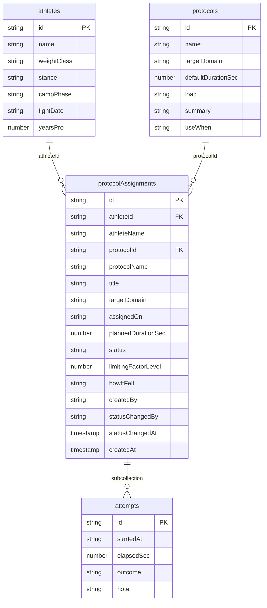

# ผังข้อมูล Firestore — NakMuay (Week 6)

เอกสารนี้คือ **ขั้น B ของการบ้าน Week 6** — ผังข้อมูลจริงที่โค้ดในโฟลเดอร์ `app/` ใช้งาน

ต่างจาก [[db-spec]] ที่เขียนแบบ conceptual (ยังไม่ผูกกับฐานข้อมูลตัวใด) เอกสารนี้ผูกกับ
Firestore ของโปรเจกต์ `nakmuay-8f508` โดยตรง ระบุชื่อ collection ชื่อ field และชนิดข้อมูล
ที่โค้ดอ่านและเขียนจริง ถ้าสองเอกสารขัดกัน ให้ถือว่า [[db-spec]] คือเจตนา และเอกสารนี้คือ
สิ่งที่ build นี้ทำได้จริง

## 1. ภาพรวม

ระบบเก็บ **โปรโตคอลฟื้นตัว 1 อย่าง ที่นักมวย 1 คน ได้รับใน 1 วัน** พร้อมสถานะที่นักมวย
กดเองและร่องรอยว่าเขาลงมือทำจริงกี่ครั้ง

Firestore ไม่มี JOIN ดังนั้นเอกสารนี้จึง **ทำ denormalisation** — คัดลอกฟิลด์ที่หน้าจอ
ต้องแสดงคู่กัน (เช่น `athleteName`, `protocolName`) ลงไปเก็บซ้ำในเอกสารหลัก เพื่อให้หน้า
รายการอ่านได้ด้วยการ query ครั้งเดียว

## 2. `athletes` — เจ้าของข้อมูล

| Field | ชนิด | ตัวอย่าง | หมายเหตุ |
|---|---|---|---|
| *(document id)* | string | `a001` | กำหนดเอง ไม่ให้ Firestore สุ่ม เพื่อให้ seed ซ้ำได้ |
| `name` | string | `Somchai Wongsa` | ชื่อที่แสดงบนหน้าจอ |
| `weightClass` | string | `Super lightweight (63.5 kg)` | พิกัดน้ำหนัก |
| `stance` | string | `Orthodox` | `Orthodox` หรือ `Southpaw` |
| `campPhase` | string | `Build` | 1 ใน 6 ช่วงของ fight camp — `Off-camp`, `Build`, `Sharpen`, `Weight cut`, `Weigh-in→Fight`, `Post-fight` |
| `fightDate` | string \| null | `2026-10-08` | รูปแบบ `yyyy-mm-dd` เป็น `null` เมื่ออยู่นอกแคมป์ |
| `yearsPro` | number | `7` | จำนวนปีที่ชกอาชีพ |

จำนวนตัวอย่างที่ seed: **3 เอกสาร**

## 3. `protocols` — คลังโปรโตคอล (collection หมวดหมู่)

| Field | ชนิด | ตัวอย่าง | หมายเหตุ |
|---|---|---|---|
| *(document id)* | string | `p001` | กำหนดเอง |
| `name` | string | `Neuro deload` | ชื่อโปรโตคอล |
| `targetDomain` | string | `Brain` | 1 ใน 6 domain — `Brain`, `Fuel & Weight`, `Sleep & Heart`, `Power & Speed`, `Body`, `Mind` |
| `defaultDurationSec` | number | `1200` | เวลาที่ต้องใช้ (วินาที) — หน้าจอแปลงเป็นนาทีเอง |
| `load` | string | `Very light` | ระดับภาระที่เพิ่มเข้าไป — `Rest`, `Very light`, `Light` |
| `summary` | string | ข้อความสั้น | ทำอะไรบ้าง |
| `useWhen` | string | ข้อความสั้น | ใช้เมื่อ domain นี้เป็น limiting factor |

**1 โปรโตคอล = 1 domain เท่านั้น** เพราะระบบไม่เคยเฉลี่ย domain (FR-23) แต่จัดการกับ
domain ที่ต่ำสุดทีละอัน

จำนวนตัวอย่างที่ seed: **3 เอกสาร**

## 4. `protocolAssignments` — collection หลัก

| Field | ชนิด | ตัวอย่าง | หมายเหตุ |
|---|---|---|---|
| *(document id)* | string | `pa001` | seed ใช้ id คงที่ ส่วนที่ผู้ใช้สร้างใหม่ใช้ `addDoc` (id สุ่ม) |
| `athleteId` | string | `a001` | **ฟิลด์เจ้าของ** อ้างถึง `athletes` |
| `athleteName` | string | `Somchai Wongsa` | denormalised จาก `athletes` |
| `protocolId` | string | `p001` | อ้างถึง `protocols` |
| `protocolName` | string | `Neuro deload` | denormalised จาก `protocols` |
| `title` | string | `Neuro deload` | หัวข้อที่แสดงบนการ์ด ปัจจุบันเท่ากับ `protocolName` แยกไว้เพื่อให้ตั้งชื่อเฉพาะวันได้ในอนาคต |
| `targetDomain` | string | `Brain` | denormalised จาก `protocols` ใช้กรองรายการ |
| `assignedOn` | string | `2026-09-04` | รูปแบบ `yyyy-mm-dd` — เรียงเป็นตัวอักษรได้ตรงกับเรียงตามวัน |
| `plannedDurationSec` | number | `1200` | เวลาที่ตั้งใจจะใช้ (วินาที) คัดลอกจาก `protocols.defaultDurationSec` แล้วแก้ได้ |
| `status` | string | `pending` | `pending` \| `completed` \| `skipped` (FR-28 / FR-29) |
| `limitingFactorLevel` | number | `2` | ระดับ 1–5 ของ domain ที่ต่ำสุดในวันนั้น (FR-22 — ไม่ใช่ 0–100) |
| `howItFelt` | string | ข้อความยาว | **ฟิลด์ข้อความยาว** นักมวยเขียนเอง เป็นข้อมูลที่ AI ใน Week 8 จะอ่าน |
| `createdBy` | string | `athlete` | ในระบบนี้เป็น `athlete` เสมอ |
| `statusChangedBy` | string \| null | `athlete` | `null` เมื่อยัง `pending` — **ไม่มีผู้อนุมัติในระบบนี้** |
| `statusChangedAt` | timestamp | — | `serverTimestamp()` ตอนกดเปลี่ยนสถานะ |
| `createdAt` | timestamp | — | `serverTimestamp()` ตอนสร้าง |

**กฎ 1 วัน 1 โปรโตคอล (FR-28)** — Firestore ไม่มี unique constraint จึงบังคับในโค้ด
`app/js/new-assignment.js` ด้วยการอ่านรายการที่มีอยู่แล้วเทียบคู่ `athleteId` + `assignedOn`
ก่อนบันทึก ถ้าซ้ำจะแจ้งผู้ใช้และไม่เขียน

จำนวนตัวอย่างที่ seed: **5 เอกสาร** — `pending` 3 · `completed` 1 · `skipped` 1

## 5. `attempts` — subcollection

path: `protocolAssignments/{assignmentId}/attempts/{attemptId}`

| Field | ชนิด | ตัวอย่าง | หมายเหตุ |
|---|---|---|---|
| *(document id)* | string | `at001` | กำหนดเองใน seed |
| `startedAt` | string | `2026-09-04` | วันที่เริ่มลงมือ |
| `elapsedSec` | number | `720` | ทำไปกี่วินาที |
| `outcome` | string | `stopped early` | ผลของครั้งนั้น — `finished the timer`, `stopped early`, `skipped tonight` |
| `note` | string | ข้อความสั้น | ทำไมไม่จบ / สภาพแวดล้อม |

เหตุผลที่ต้องเป็น subcollection ไม่ใช่ array ในเอกสารหลัก: นักมวยมักแบ่งทำหลายรอบต่อวัน
และแต่ละรอบมีเวลาของตัวเอง การเก็บเป็นเอกสารแยกทำให้เพิ่มรอบใหม่ได้โดยไม่ต้องเขียน
เอกสารหลักทับทั้งก้อน

จำนวนตัวอย่างที่ seed: **3 เอกสาร** — 2 ใต้ `pa001`, 1 ใต้ `pa002`

## 6. Query ที่โค้ดใช้

| หน้า | Query | Index |
|---|---|---|
| `index.html` | `getDocs(protocolAssignments)` แล้วนับตามสถานะฝั่ง client | ไม่ต้องสร้าง |
| `assignments.html` | `query(protocolAssignments, orderBy("assignedOn", "desc"))` | single-field index ที่ Firestore สร้างให้อัตโนมัติ |
| `assignment-detail.html` | `getDoc(protocolAssignments/{id})` + `query(attempts, orderBy("startedAt"))` | ไม่ต้องสร้าง |
| `new-assignment.html` | อ่าน `athletes`, `protocols` มาทำ dropdown + ตรวจ FR-28 | ไม่ต้องสร้าง |

การกรองตามสถานะบนหน้ารายการทำ**ฝั่ง client** ไม่ใช่ใน query เพราะการรวม `where("status")`
กับ `orderBy("assignedOn")` ต้องสร้าง composite index ซึ่งเกินขอบเขตการบ้านนี้ และข้อมูล
ตัวอย่างมีเพียง 5 เอกสาร

## 7. ช่องว่างที่ยังไม่ปิด

- **domain `Mind` ยังไม่มี FR ที่รับข้อมูลรายวัน** — ปัญหาเดิมที่บันทึกไว้แล้วใน
  [[architecture]], [[api-spec]] และ [[db-spec]] จึงยัง seed โปรโตคอลของ `Mind` ไม่ได้
- **Security rules อยู่ใน Test mode** ฐานข้อมูลนี้เก็บข้อมูลตัวอย่างเท่านั้น ไม่มีข้อมูล
  ส่วนบุคคลจริง ก่อนใช้งานจริงต้องเขียน rules ให้นักมวยอ่าน–เขียนได้แค่เอกสารของตัวเอง
- **ยังไม่มี Auth** `athleteId` จึงเลือกจาก dropdown แทนที่จะมาจากผู้ใช้ที่ล็อกอิน

## เอกสารที่เกี่ยวข้อง

- [[db-spec]] — ผังข้อมูลเชิงแนวคิด
- [[api-spec]] — สัญญาระหว่างหน้าจอกับข้อมูล
- [[architecture]] — ภาพรวมสถาปัตยกรรม
- [[20260828-01-boxer-recovery-tracking]] — requirement spec ต้นทาง
