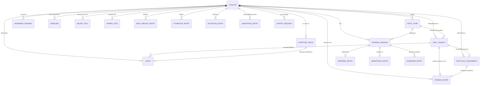

# Database Spec — NakMuay

โมเดลข้อมูลเชิง logical — **ไม่ผูกกับ database engine ใดๆ** ชนิดข้อมูลอธิบายเป็นเชิงตรรกะเท่านั้น

- ปรับปรุงล่าสุด: 28 สิงหาคม 2569
- แหล่งความจริง: [[architecture]] (component) · [[feature-list]] · [[backlog]]
- เอกสารคู่กัน: [[api-spec]] — ทุก field ในนั้นต้องสืบย้อนมาถึงตารางในไฟล์นี้ได้

**ชนิดข้อมูลเชิงตรรกะที่ใช้:** `ข้อความ` · `จำนวนเต็ม` · `ทศนิยม` · `วันที่` · `วันเวลา` · `ค่าจริงเท็จ` · `รายการค่าที่กำหนด` · `ตัวระบุ`
🔒 = ข้อมูลสุขภาพหรือข้อมูลส่วนบุคคล ต้องเข้ารหัสตาม [[backlog|NFR-02]] และห้ามเปิดเผยตาม [[backlog|NFR-03]]

---

## 1. ER Diagram

---

## 2. รายละเอียดต่อ Entity

### ATHLETE — [[backlog|FR-01]]

| Attribute | ความหมาย | จำเป็น | ข้อจำกัด / กฎเชิงธุรกิจ | ที่มา |
|---|---|---|---|---|
| athlete_id | ตัวระบุนักมวย | ใช่ | ไม่ซ้ำทั้งระบบ | FR-01 |
| display_name 🔒 | ชื่อที่ใช้แสดง | ใช่ | — | FR-01 |
| sex 🔒 | เพศ | ใช่ | รายการค่าที่กำหนด — ใช้เลือกว่าจะเปิด overlay รอบเดือนหรือไม่ | FR-01 |
| birth_date 🔒 | วันเกิด | ใช่ | ต้องอยู่ในอดีต | FR-01 |
| height_cm | ส่วนสูง | ใช่ | ทศนิยม มากกว่า 0 | FR-01 |
| default_weight_class_kg | พิกัดน้ำหนักที่ลงแข่งเป็นปกติ | ใช่ | ทศนิยม มากกว่า 0 | FR-01 |
| locale | ภาษาที่เลือก | ไม่ | รายการค่าที่กำหนด: ไทย / อังกฤษ | NFR-09 |
| created_at | เวลาที่สร้างบัญชี | ใช่ | — | — |

### FIGHT_CAMP — [[backlog|FR-02]] [[backlog|FR-03]] [[backlog|FR-04]]

| Attribute | ความหมาย | จำเป็น | ข้อจำกัด / กฎเชิงธุรกิจ | ที่มา |
|---|---|---|---|---|
| camp_id | ตัวระบุแคมป์ | ใช่ | — | FR-02 |
| athlete_id | เจ้าของแคมป์ | ใช่ | อ้างถึง ATHLETE | FR-02 |
| fight_date | วันชก | ใช่ | ต้องอยู่หลัง weigh_in_date | FR-02 |
| weigh_in_date | วันชั่งน้ำหนัก | ใช่ | **ต้องอยู่ก่อน fight_date** มิฉะนั้นไม่บันทึก | FR-02 |
| weight_class_kg | พิกัดของไฟต์นี้ | ใช่ | ทศนิยม อาจต่างจากค่าปกติของนักมวย | FR-02 |
| weigh_in_confirmed | ยืนยันว่าชั่งผ่านแล้ว | ใช่ | ค่าจริงเท็จ — เป็นตัวเปิดโหมดหลังชั่ง | FR-20 |
| status | สถานะแคมป์ | ใช่ | รายการค่าที่กำหนด: วางแผน / กำลังดำเนิน / จบแล้ว / ยกเลิก | FR-04 |

> **ช่วงแคมป์ (camp phase) เป็นค่าที่คำนวณ ไม่ใช่ attribute ที่เก็บ** — คำนวณจาก `fight_date`,
> `weigh_in_date` และวันที่ปัจจุบันทุกครั้งที่เรียก เพื่อให้การเลื่อนวันชก ([[backlog|FR-04]])
> มีผลย้อนหลังทันทีโดยไม่ต้องไล่แก้ข้อมูลเก่า

### WEARABLE_READING — [[backlog|FR-05]]

| Attribute | ความหมาย | จำเป็น | ข้อจำกัด | ที่มา |
|---|---|---|---|---|
| reading_id | ตัวระบุ | ใช่ | — | FR-05 |
| athlete_id | เจ้าของ | ใช่ | อ้างถึง ATHLETE | FR-05 |
| night_of | คืนที่ข้อมูลนี้ครอบคลุม | ใช่ | วันที่ · ไม่ซ้ำต่อ athlete หนึ่งคนต่อหนึ่งคืน | FR-05 |
| hrv 🔒 | ค่าความแปรปรวนของหัวใจ | ไม่ | ทศนิยม · ว่างได้ถ้าอุปกรณ์ยังไม่ซิงก์ | FR-05 |
| resting_hr 🔒 | ชีพจรขณะพัก | ไม่ | จำนวนเต็ม | FR-05 |
| sleep_total_min 🔒 | เวลานอนรวม | ไม่ | จำนวนเต็ม | FR-05 |
| sleep_deep_min 🔒 | เวลาหลับลึก | ไม่ | จำนวนเต็ม | FR-05 |
| sleep_efficiency 🔒 | ประสิทธิภาพการนอน | ไม่ | ทศนิยม 0–1 | FR-05 |
| synced_at | เวลาที่ดึงข้อมูลมา | ใช่ | — | FR-05 |

> ทุก attribute ยกเว้นตัวระบุ **ว่างได้** เพราะ [[backlog|FR-05]] กำหนดว่าถ้าอุปกรณ์ยังไม่ซิงก์
> ระบบต้องแสดงว่าไม่มีข้อมูล ไม่ใช่เดาค่า

### BASELINE — [[backlog|FR-06]]

| Attribute | ความหมาย | จำเป็น | ข้อจำกัด | ที่มา |
|---|---|---|---|---|
| baseline_id | ตัวระบุ | ใช่ | — | FR-06 |
| athlete_id | เจ้าของ | ใช่ | อ้างถึง ATHLETE | FR-06 |
| signal | สัญญาณที่เป็น baseline | ใช่ | รายการค่าที่กำหนด: hrv / resting_hr / sleep_deep / reaction_time / punch_count | FR-06, FR-13, FR-14 |
| central_value | ค่ากลางของนักมวยคนนี้ | ใช่ | ทศนิยม | FR-06 |
| spread | ความผันผวนปกติของคนนี้ | ใช่ | ทศนิยม | FR-06 |
| sample_days | จำนวนวันที่ใช้คำนวณ | ใช่ | จำนวนเต็ม · **ต่ำกว่า 14 = ยังใช้ไม่ได้** | FR-06 |
| computed_at | เวลาที่คำนวณล่าสุด | ใช่ | — | FR-06 |

### TRAINING_SESSION — [[backlog|FR-07]] [[backlog|FR-10]]

| Attribute | ความหมาย | จำเป็น | ข้อจำกัด | ที่มา |
|---|---|---|---|---|
| session_id | ตัวระบุ | ใช่ | — | FR-07 |
| athlete_id | เจ้าของ | ใช่ | อ้างถึง ATHLETE | FR-07 |
| camp_id | แคมป์ที่สังกัด | ไม่ | ว่างได้ถ้าอยู่ช่วง Off-camp | FR-03 |
| load_type | สกุลโหลด | ใช่ | รายการค่าที่กำหนด: สปาร์ริง / มวยเทคนิค / คาร์ดิโอ / ยกเวท — **จำเป็นเสมอ ไม่มีค่าเริ่มต้น** | FR-07 |
| occurred_on | วันที่ซ้อม | ใช่ | วันที่ | FR-07 |
| duration_min | ระยะเวลา | ใช่ | จำนวนเต็ม มากกว่า 0 | FR-07 |
| synced | ซิงก์ขึ้นแล้วหรือยัง | ใช่ | ค่าจริงเท็จ — รองรับการบันทึกออฟไลน์ | NFR-06 |

> **ยอดสะสมสปาร์ริง 7/28 วัน ([[backlog|FR-10]]) เป็นค่าที่คำนวณจาก entity นี้** โดยกรองเฉพาะ
> `load_type = สปาร์ริง` ไม่เก็บเป็น attribute เพราะต้องเปลี่ยนทุกครั้งที่หน้าต่างเวลาเลื่อน

### SPARRING_DETAIL — [[backlog|FR-08]]

| Attribute | ความหมาย | จำเป็น | ข้อจำกัด | ที่มา |
|---|---|---|---|---|
| session_id | เซสชันที่ผูกอยู่ | ใช่ | หนึ่งต่อหนึ่งกับ TRAINING_SESSION ที่ load_type เป็นสปาร์ริง | FR-08 |
| rounds | จำนวนยก | ใช่ | จำนวนเต็ม มากกว่า 0 — **บันทึกไม่ได้ถ้าเว้นว่าง** | FR-08 |
| intensity | ระดับความหนัก | ใช่ | รายการค่าที่กำหนด: เบา / กลาง / หนัก | FR-08 |

### RESISTANCE_DETAIL — [[backlog|FR-09]]

| Attribute | ความหมาย | จำเป็น | ข้อจำกัด | ที่มา |
|---|---|---|---|---|
| session_id | เซสชันที่ผูกอยู่ | ใช่ | หนึ่งต่อหนึ่งกับ TRAINING_SESSION ที่ load_type เป็นยกเวท | FR-09 |
| body_region | ส่วนของร่างกาย | ใช่ | รายการค่าที่กำหนด: ท่อนบน / ท่อนล่าง / ทั้งตัว | FR-09 |
| intensity | ความหนัก | ใช่ | รายการค่าที่กำหนด: เบา / กลาง / หนัก | FR-09 |

### SORENESS_ENTRY — [[backlog|FR-11]]

| Attribute | ความหมาย | จำเป็น | ข้อจำกัด | ที่มา |
|---|---|---|---|---|
| soreness_id | ตัวระบุ | ใช่ | — | FR-11 |
| session_id | เซสชันที่บันทึกพร้อมกัน | ไม่ | ว่างได้ถ้าบันทึกนอกเซสชัน | FR-11 |
| athlete_id | เจ้าของ | ใช่ | อ้างถึง ATHLETE | FR-11 |
| recorded_on | วันที่บันทึก | ใช่ | วันที่ | FR-11 |
| body_part | ตำแหน่ง | ใช่ | รายการค่าที่กำหนด อย่างน้อย: มือ/ข้อมือ · ไหล่ · คอ · หลังล่าง · สะโพก · น่อง | FR-11 |
| severity 🔒 | ระดับความปวด | ใช่ | จำนวนเต็ม 1–5 | FR-11 |

### SYMPTOM_CHECK — [[backlog|FR-12]]

| Attribute | ความหมาย | จำเป็น | ข้อจำกัด | ที่มา |
|---|---|---|---|---|
| check_id | ตัวระบุ | ใช่ | — | FR-12 |
| athlete_id | เจ้าของ | ใช่ | อ้างถึง ATHLETE | FR-12 |
| checked_on | วันที่ตอบ | ใช่ | วันที่ · หนึ่งครั้งต่อวัน | FR-12 |
| no_symptoms | กด "ไม่มีอาการ" | ใช่ | ค่าจริงเท็จ — **ถ้าเป็นจริง รายการอาการต้องว่าง** | FR-12 |
| symptoms 🔒 | รายการอาการที่เลือก | ไม่ | หลายค่าจากรายการที่กำหนด: ปวดศีรษะ · ตาพร่า · ไวต่อแสง · มึนงง · คลื่นไส้ · นอนไม่หลับ · อารมณ์แปรปรวน | FR-12 |

### NEURO_TEST — [[backlog|FR-13]] [[backlog|FR-15]]

| Attribute | ความหมาย | จำเป็น | ข้อจำกัด | ที่มา |
|---|---|---|---|---|
| test_id | ตัวระบุ | ใช่ | — | FR-13 |
| athlete_id | เจ้าของ | ใช่ | อ้างถึง ATHLETE | FR-13 |
| test_type | ชนิดการทดสอบ | ใช่ | รายการค่าที่กำหนด: เวลาตอบสนอง / การทรงตัว | FR-13, FR-15 |
| taken_at | เวลาที่ทดสอบ | ใช่ | วันเวลา | FR-13 |
| raw_value 🔒 | ค่าที่วัดได้ | ใช่ | ทศนิยม — มิลลิวินาทีสำหรับเวลาตอบสนอง / ดัชนีการแกว่งสำหรับการทรงตัว | FR-13, FR-15 |
| duration_sec | เวลาที่ใช้ทดสอบ | ใช่ | จำนวนเต็ม · **ไม่เกิน 30** สำหรับเวลาตอบสนอง | FR-13 |

### POWER_TEST — [[backlog|FR-14]]

| Attribute | ความหมาย | จำเป็น | ข้อจำกัด | ที่มา |
|---|---|---|---|---|
| test_id | ตัวระบุ | ใช่ | — | FR-14 |
| athlete_id | เจ้าของ | ใช่ | อ้างถึง ATHLETE | FR-14 |
| taken_at | เวลาที่ทดสอบ | ใช่ | วันเวลา | FR-14 |
| punch_count | จำนวนหมัดใน 10 วินาที | ใช่ | จำนวนเต็ม มากกว่า 0 | FR-14 |
| personal_best_at_time | สถิติดีที่สุดของตนเองขณะนั้น | ใช่ | จำนวนเต็ม — เก็บไว้เพื่อให้ย้อนดูได้ว่าคำนวณร้อยละจากอะไร | FR-14 |

### BODY_WEIGHT_ENTRY — [[backlog|FR-16]] [[backlog|FR-19]]

| Attribute | ความหมาย | จำเป็น | ข้อจำกัด | ที่มา |
|---|---|---|---|---|
| entry_id | ตัวระบุ | ใช่ | — | FR-16 |
| athlete_id | เจ้าของ | ใช่ | อ้างถึง ATHLETE | FR-16 |
| measured_on | วันที่ชั่ง | ใช่ | วันที่ · หนึ่งครั้งต่อวัน | FR-16 |
| weight_kg 🔒 | น้ำหนัก | ใช่ | ทศนิยม มากกว่า 0 | FR-16 |

> อัตราการลดต่อสัปดาห์ ([[backlog|FR-19]]) เป็นค่าที่คำนวณจากรายการย้อนหลัง 7 วัน ไม่เก็บซ้ำ

### HYDRATION_ENTRY — [[backlog|FR-17]]

| Attribute | ความหมาย | จำเป็น | ข้อจำกัด | ที่มา |
|---|---|---|---|---|
| entry_id | ตัวระบุ | ใช่ | — | FR-17 |
| athlete_id | เจ้าของ | ใช่ | อ้างถึง ATHLETE | FR-17 |
| recorded_on | วันที่บันทึก | ใช่ | วันที่ | FR-17 |
| urine_shade 🔒 | ระดับสีปัสสาวะ | ไม่ | จำนวนเต็ม **1–8 เท่านั้น** | FR-17 |
| fluid_ml | ปริมาณน้ำที่ดื่ม | ไม่ | จำนวนเต็ม ไม่ติดลบ | FR-17 |

### NUTRITION_ENTRY — [[backlog|FR-18]]

| Attribute | ความหมาย | จำเป็น | ข้อจำกัด | ที่มา |
|---|---|---|---|---|
| entry_id | ตัวระบุ | ใช่ | — | FR-18 |
| athlete_id | เจ้าของ | ใช่ | อ้างถึง ATHLETE | FR-18 |
| recorded_on | วันที่บันทึก | ใช่ | วันที่ | FR-18 |
| ate_after_training | กินหลังซ้อมแล้วหรือยัง | ใช่ | ค่าจริงเท็จ | FR-18 |
| protein_meals | มื้อที่ได้โปรตีน | ใช่ | หลายค่า: เช้า / กลางวัน / เย็น | FR-18 |
| carb_level | ระดับแป้ง | ใช่ | รายการค่าที่กำหนด: น้อย / กลาง / มาก | FR-18 |

> **ห้ามมี attribute ที่เก็บแคลอรี่หรือน้ำหนักอาหาร** ตาม [[backlog|FR-18]] และ [[backlog|NFR-01]]

### SUBSTANCE_ENTRY — [[backlog|FR-21]]

| Attribute | ความหมาย | จำเป็น | ข้อจำกัด | ที่มา |
|---|---|---|---|---|
| entry_id | ตัวระบุ | ใช่ | — | FR-21 |
| athlete_id | เจ้าของ | ใช่ | อ้างถึง ATHLETE | FR-21 |
| substance | ชนิด | ใช่ | รายการค่าที่กำหนด: คาเฟอีน / แอลกอฮอล์ | FR-21 |
| consumed_at | เวลาที่บริโภค | ใช่ | วันเวลา — ต้องมีเวลา ไม่ใช่แค่วันที่ เพราะต้องเทียบกับคุณภาพการนอน | FR-21 |
| amount 🔒 | ปริมาณ | ไม่ | ทศนิยม | FR-21 |

### DOMAIN_SCORE — [[backlog|FR-22]] [[backlog|FR-24]] [[backlog|NFR-08]]

| Attribute | ความหมาย | จำเป็น | ข้อจำกัด | ที่มา |
|---|---|---|---|---|
| score_id | ตัวระบุ | ใช่ | — | FR-22 |
| athlete_id | เจ้าของ | ใช่ | อ้างถึง ATHLETE | FR-22 |
| scored_on | วันที่ของคะแนน | ใช่ | วันที่ | FR-22 |
| domain | หมวด | ใช่ | รายการค่าที่กำหนด 6 ค่า: Brain / Fuel & Weight / Sleep & Heart / Power & Speed / Body / Mind | FR-22 |
| level | ระดับคะแนน | ไม่ | จำนวนเต็ม **1–5 เท่านั้น** · **ว่างได้** เมื่อข้อมูลไม่พอ | FR-22 |
| data_available | มีข้อมูลพอคำนวณหรือไม่ | ใช่ | ค่าจริงเท็จ — ถ้าเป็นเท็จ ห้ามนำไปคิดเป็น limiting factor | FR-22 |
| camp_phase_at_scoring | ช่วงแคมป์ขณะคำนวณ | ใช่ | รายการค่าที่กำหนด 6 ช่วง — เก็บไว้เพราะเกณฑ์ต่างกันตามช่วง | FR-24 |
| contributing_factors | ปัจจัยที่ทำให้คะแนนขึ้นหรือลง | ใช่ | รายการรหัสเหตุผล — **ถ้าว่าง ห้ามแสดงคะแนน** | NFR-08 |

> `contributing_factors` เก็บเป็น **รหัสเหตุผล** ไม่ใช่ประโยค เพื่อรองรับสองภาษา ([[backlog|NFR-09]])

### DAILY_VERDICT — [[backlog|FR-23]] [[backlog|FR-25]]

| Attribute | ความหมาย | จำเป็น | ข้อจำกัด | ที่มา |
|---|---|---|---|---|
| verdict_id | ตัวระบุ | ใช่ | — | FR-23 |
| athlete_id | เจ้าของ | ใช่ | อ้างถึง ATHLETE | FR-23 |
| verdict_on | วันที่ | ใช่ | วันที่ · หนึ่งครั้งต่อวัน | FR-23 |
| limiting_domains | หมวดที่เป็น limiting factor | ใช่ | **หลายค่าได้** เพราะเสมอกันได้ | FR-23 |
| session_menu | สถานะต่อสกุลโหลด | ใช่ | 4 รายการเสมอ แต่ละรายการมี สกุลโหลด + สถานะ (ทำได้ / ทำได้แบบจำกัด / ควรงด) + รหัสเหตุผล | FR-25 |
| camp_phase | ช่วงแคมป์ของวันนั้น | ใช่ | รายการค่าที่กำหนด 6 ช่วง | FR-03, FR-24 |

### ALERT — [[backlog|FR-19]] [[backlog|FR-26]] [[backlog|FR-27]]

| Attribute | ความหมาย | จำเป็น | ข้อจำกัด | ที่มา |
|---|---|---|---|---|
| alert_id | ตัวระบุ | ใช่ | — | FR-26 |
| athlete_id | เจ้าของ | ใช่ | อ้างถึง ATHLETE | FR-26 |
| alert_type | ชนิดคำเตือน | ใช่ | รายการค่าที่กำหนด: ภาระที่ศีรษะ / อัตราการลดน้ำหนัก / ภาวะซ้อมเกิน | FR-19, FR-26, FR-27 |
| raised_on | วันที่เกิด | ใช่ | วันที่ | FR-26 |
| trigger_reason | รหัสเหตุผลและค่าที่ทำให้เข้าเกณฑ์ | ใช่ | รหัสเหตุผล + ค่าประกอบ เช่น จำนวนอาการ, ยอดสปาร์ริง 7 วัน, จำนวนวันต่อเนื่อง | FR-26, FR-27 |
| requires_medical_referral | ต้องแนะนำให้พบแพทย์หรือไม่ | ใช่ | ค่าจริงเท็จ — **ต้องเป็นจริงเสมอสำหรับคำเตือนภาระที่ศีรษะ** | NFR-04 |
| acknowledged_at | เวลาที่ผู้ใช้รับทราบ | ไม่ | วันเวลา | FR-26 |

> **ห้ามมี attribute ใดที่เก็บชื่อภาวะหรือโรค** ตาม [[backlog|NFR-04]] — เก็บได้เพียงเงื่อนไขที่วัดได้

### PROTOCOL_ASSIGNMENT — [[backlog|FR-28]] [[backlog|FR-29]] [[backlog|FR-30]]

| Attribute | ความหมาย | จำเป็น | ข้อจำกัด | ที่มา |
|---|---|---|---|---|
| assignment_id | ตัวระบุ | ใช่ | — | FR-28 |
| athlete_id | เจ้าของ | ใช่ | อ้างถึง ATHLETE | FR-28 |
| assigned_on | วันที่มอบหมาย | ใช่ | วันที่ · **หนึ่งรายการต่อหนึ่งวันเท่านั้น** | FR-28 |
| protocol_code | โปรโตคอลที่เลือก | ใช่ | รหัสจากรายการที่กำหนด | FR-28 |
| target_domain | หมวดที่โปรโตคอลนี้มุ่งแก้ | ใช่ | ต้องตรงกับ limiting factor ของวันนั้น | FR-28 |
| planned_duration_sec | เวลาที่กำหนด | ใช่ | จำนวนเต็ม | FR-28 |
| completion_status | ผลการทำ | ใช่ | รายการค่าที่กำหนด: ยังไม่เริ่ม / ทำครบแล้ว / ข้าม / เริ่มแต่ไม่จบ | FR-29 |
| completed_at | เวลาที่จบตัวจับเวลา | ไม่ | วันเวลา · มีค่าเฉพาะเมื่อ completion_status เป็น "ทำครบแล้ว" | FR-29 |
| next_day_delta | ผลต่างคะแนนหมวดนั้นในวันถัดไป | ไม่ | ทศนิยม · เติมภายหลังเมื่อคะแนนวันถัดไปคำนวณเสร็จ | FR-30 |

### EXPORT_REQUEST — [[backlog|FR-33]] [[backlog|NFR-03]]

| Attribute | ความหมาย | จำเป็น | ข้อจำกัด | ที่มา |
|---|---|---|---|---|
| request_id | ตัวระบุ | ใช่ | — | FR-33 |
| athlete_id | ผู้ขอ | ใช่ | อ้างถึง ATHLETE | FR-33 |
| range_from / range_to | ช่วงเวลาที่ขอ | ใช่ | วันที่ · from ต้องไม่หลัง to | FR-33 |
| requested_at | เวลาที่ขอ | ใช่ | วันเวลา | FR-33 |
| consent_confirmed | ยืนยันความยินยอมแล้ว | ใช่ | ค่าจริงเท็จ — **ต้องเป็นจริงก่อนสร้างไฟล์ได้** | NFR-03 |

---

## 3. กฎความสัมพันธ์ที่สำคัญ

| ความสัมพันธ์ | ความหมายเชิงธุรกิจ |
|---|---|
| `TRAINING_SESSION ||--o| SPARRING_DETAIL` | รายละเอียดสปาร์ริงมีได้เฉพาะเมื่อ `load_type` เป็นสปาร์ริง — **นี่คือกลไกที่ทำให้ยอดสะสมสปาร์ริงแยกจากโหลดอื่นได้จริง** ตาม [[backlog\|FR-10]] |
| `DAILY_VERDICT ||--|{ DOMAIN_SCORE` | คำตัดสินหนึ่งวันต้องอ้างคะแนนครบทั้ง 6 หมวดเสมอ ถึงบางหมวดจะไม่มีข้อมูลก็ต้องมีแถวที่ `data_available` เป็นเท็จ |
| `PROTOCOL_ASSIGNMENT ||--o| DOMAIN_SCORE` | ผูกกับคะแนน **วันถัดไป** ของ `target_domain` เท่านั้น — นี่คือวงจรตรวจสอบย้อนกลับตาม [[backlog\|FR-30]] |
| `SYMPTOM_CHECK ||--o{ ALERT` | คำเตือนภาระที่ศีรษะต้องสืบย้อนกลับไปหาอาการที่ผู้ใช้เลือกจริงได้เสมอ เพื่อให้ตรวจสอบได้ตาม [[backlog\|NFR-08]] |

---

## 4. ช่องว่างที่พบระหว่างออกแบบ

| ช่องว่าง | ผลกระทบ |
|---|---|
| **ไม่มี entity สำหรับอินพุตของหมวด Mind** | [[backlog]] ไม่มีรหัส FR ที่ระบุการเก็บอารมณ์/ความเครียดรายวัน ทำให้ `DOMAIN_SCORE` ของหมวด Mind จะมี `data_available` เป็นเท็จตลอด — **ต้องเพิ่ม FR ใหม่ก่อนเริ่มพัฒนา** (ดู [[architecture#6. ช่องว่างที่พบระหว่างออกแบบ\|architecture §6]]) |
| **รอบเดือนยังไม่มี entity** | [[feature-list]] ระบุว่าเป็น overlay ทับทุกหมวด แต่ยังไม่มีรหัส FR รองรับ |
