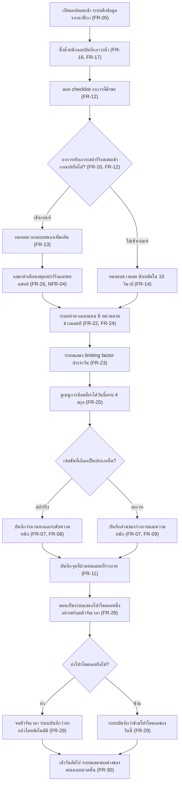
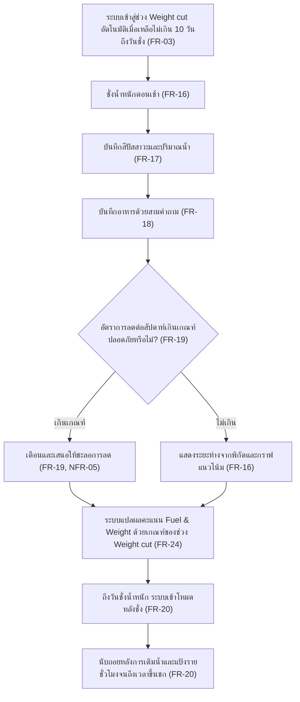
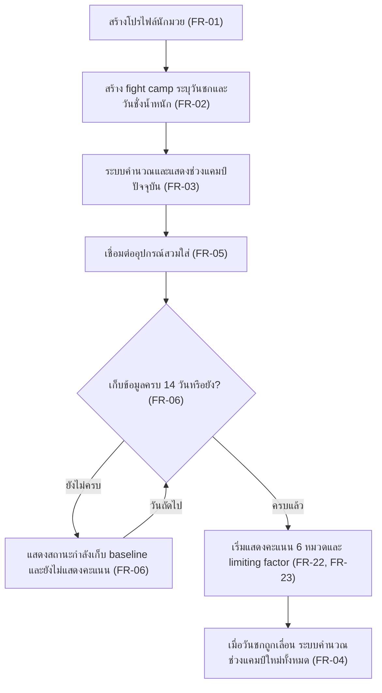

# User Journey — NakMuay

แมปฟีเจอร์จาก [[feature-list]] เป็นลำดับการใช้งานจริงตามสถานการณ์

- ปรับปรุงล่าสุด: 28 สิงหาคม 2569
- แหล่งความจริง: [[feature-list]] · [[backlog]]
- บทบาทผู้ใช้ในเฟสนี้: นักมวย (Athlete) เพียงบทบาทเดียว

---

## Journey 1: เช้าหลังวันสปาร์ริงหนัก — ตัดสินใจว่าวันนี้ซ้อมอะไรได้

**บทบาท:** นักมวย
**บริบท:** อยู่ในช่วง Build ของแคมป์ เมื่อวานสปาร์ริง 6 ยก ระดับหนัก
**นี่คือ journey หลักของระบบ** — วงจรที่นักมวยทำซ้ำเกือบทุกวันตลอดแคมป์

### ขั้นตอน

1. **เปิดแอปตอนเช้า ระบบดึงข้อมูลจากนาฬิกา** — HRV ชีพจรขณะพัก และข้อมูลการนอนของคืนที่ผ่านมาถูกดึงมาเอง นักมวยไม่ต้องกรอก ([[20260828-01-boxer-recovery-tracking#3.2 การเชื่อมต่ออุปกรณ์และ baseline|FR-05]])
2. **ชั่งน้ำหนักและบันทึกภาวะน้ำ** — น้ำหนักหลังเข้าห้องน้ำ และเลือกสีปัสสาวะจากชาร์ต ([[20260828-01-boxer-recovery-tracking#3.5 พลังงาน อาหาร และน้ำหนัก|FR-16, FR-17]])
3. **ตอบ checklist อาการที่ศีรษะ** — แตะเลือกอาการที่มี หรือกด "ไม่มีอาการ" ([[20260828-01-boxer-recovery-tracking#3.4 อาการที่ศีรษะและการทดสอบ|FR-12]])
4. **ตรวจเงื่อนไข: อาการหรือภาระสปาร์ริงสะสมเข้าเกณฑ์หรือไม่** — ระบบเทียบอาการที่เลือกกับยอดสะสมสปาร์ริง 7 วัน ([[20260828-01-boxer-recovery-tracking#3.3 การบันทึกการซ้อม|FR-10]], [[20260828-01-boxer-recovery-tracking#3.4 อาการที่ศีรษะและการทดสอบ|FR-12]])
5. **เข้าเกณฑ์ → ทดสอบเวลาตอบสนองเพิ่มเติม** — ทดสอบในแอปไม่เกิน 30 วินาที เทียบกับ baseline ของตนเอง ([[20260828-01-boxer-recovery-tracking#3.4 อาการที่ศีรษะและการทดสอบ|FR-13]])
6. **แสดงคำเตือนหยุดสปาร์ริงและพบแพทย์** — ใช้ถ้อยคำเชิงติดตาม ไม่ระบุภาวะทางการแพทย์ใดๆ ([[20260828-01-boxer-recovery-tracking#3.6 คะแนนและ limiting factor|FR-26]], [[20260828-01-boxer-recovery-tracking#4. ความต้องการที่ไม่ใช่เชิงฟังก์ชัน|NFR-04]])
7. **ไม่เข้าเกณฑ์ → ทดสอบความสด นับหมัดใน 10 วินาที** — รายงานผลเป็นร้อยละเทียบสถิติดีที่สุดของตนเอง ([[20260828-01-boxer-recovery-tracking#3.4 อาการที่ศีรษะและการทดสอบ|FR-14]])
8. **ระบบคำนวณคะแนน 6 หมวดตามช่วงแคมป์** — ใช้เกณฑ์ของช่วง Build ([[20260828-01-boxer-recovery-tracking#3.6 คะแนนและ limiting factor|FR-22, FR-24]])
9. **ระบบแสดง limiting factor ประจำวัน** — ประโยคเดียวเด่นที่สุดบนหน้าแรก เช่น "วันนี้ Brain คือเพดานของคุณ" ([[20260828-01-boxer-recovery-tracking#3.6 คะแนนและ limiting factor|FR-23]])
10. **ดูเมนูการซ้อมที่ทำได้วันนี้ครบ 4 สกุล** — สปาร์ริงขึ้นสถานะ "ควรงด" แต่ยกเวทขึ้น "ทำได้" พร้อมเหตุผลกำกับ ([[20260828-01-boxer-recovery-tracking#3.6 คะแนนและ limiting factor|FR-25]])
11. **เลือกประเภทเซสชันที่จะบันทึก** — สปาร์ริงหรือยกเวท ตามที่ซ้อมจริง
12. **สปาร์ริง → บันทึกจำนวนยกและระดับความหนัก** ([[20260828-01-boxer-recovery-tracking#3.3 การบันทึกการซ้อม|FR-07, FR-08]])
13. **ยกเวท → บันทึกส่วนของร่างกายและความหนัก** ([[20260828-01-boxer-recovery-tracking#3.3 การบันทึกการซ้อม|FR-07, FR-09]])
14. **บันทึกจุดที่ปวดบนแผนที่ร่างกาย** — แตะจุดที่ปวดและเลือกระดับ ([[20260828-01-boxer-recovery-tracking#3.3 การบันทึกการซ้อม|FR-11]])
15. **ตอนเย็นระบบเสนอโปรโตคอลหนึ่งอย่างพร้อมตัวจับเวลา** — เลือกตาม limiting factor ของวันนั้น เสนอเพียงหนึ่งอย่างเท่านั้น ([[20260828-01-boxer-recovery-tracking#3.7 โปรโตคอลและวงจรตรวจสอบย้อนกลับ|FR-28]])
16. **ตัดสินใจว่าจะทำโปรโตคอลหรือข้าม**
17. **ทำ → จบตัวจับเวลา ระบบบันทึกว่าทำแล้วโดยอัตโนมัติ** — ไม่ต้องกดยืนยันซ้ำ การจบตัวจับเวลาคือการบันทึก ([[20260828-01-boxer-recovery-tracking#3.7 โปรโตคอลและวงจรตรวจสอบย้อนกลับ|FR-29]])
18. **ข้าม → ระบบบันทึกว่าข้ามโปรโตคอลของวันนี้** ([[20260828-01-boxer-recovery-tracking#3.7 โปรโตคอลและวงจรตรวจสอบย้อนกลับ|FR-29]])
19. **เช้าวันถัดไป ระบบแสดงผลต่างของคะแนนหมวดนั้น** — ปิดวงจรว่าโปรโตคอลได้ผลกับนักมวยคนนี้จริงหรือไม่ ([[20260828-01-boxer-recovery-tracking#3.7 โปรโตคอลและวงจรตรวจสอบย้อนกลับ|FR-30]])

---

## Journey 2: สัปดาห์ทำน้ำหนัก — คุมการลดให้ปลอดภัยจนถึงวันชั่ง

**บทบาท:** นักมวย
**บริบท:** เหลือ 8 วันถึงวันชั่งน้ำหนัก ยังเกินพิกัดอยู่ 2.4 กิโลกรัม

### ขั้นตอน

1. **ระบบเข้าสู่ช่วง Weight cut อัตโนมัติเมื่อเหลือไม่เกิน 10 วันถึงวันชั่ง** — ผู้ใช้ไม่ต้องสลับโหมดเอง ([[20260828-01-boxer-recovery-tracking#3.1 โปรไฟล์และไทม์ไลน์แคมป์|FR-03]])
2. **ชั่งน้ำหนักตอนเช้า** ([[20260828-01-boxer-recovery-tracking#3.5 พลังงาน อาหาร และน้ำหนัก|FR-16]])
3. **บันทึกสีปัสสาวะและปริมาณน้ำ** — สำคัญเป็นพิเศษในช่วงนี้เพราะน้ำหนักที่ลดอาจเป็นน้ำ ไม่ใช่ไขมัน ([[20260828-01-boxer-recovery-tracking#3.5 พลังงาน อาหาร และน้ำหนัก|FR-17]])
4. **บันทึกอาหารด้วยสามคำถาม** — กินหลังซ้อมแล้วหรือยัง, โปรตีนครบสามมื้อหรือไม่, ระดับแป้งวันนี้ ([[20260828-01-boxer-recovery-tracking#3.5 พลังงาน อาหาร และน้ำหนัก|FR-18]])
5. **ตรวจเงื่อนไข: อัตราการลดต่อสัปดาห์เกินเกณฑ์ปลอดภัยหรือไม่** ([[20260828-01-boxer-recovery-tracking#3.5 พลังงาน อาหาร และน้ำหนัก|FR-19]])
6. **เกินเกณฑ์ → เตือนและเสนอให้ชะลอการลด** — ระบบไม่เสนอวิธีรีดน้ำหนักให้เร็วขึ้นไม่ว่ากรณีใด ([[20260828-01-boxer-recovery-tracking#3.5 พลังงาน อาหาร และน้ำหนัก|FR-19]], [[20260828-01-boxer-recovery-tracking#4. ความต้องการที่ไม่ใช่เชิงฟังก์ชัน|NFR-05]])
7. **ไม่เกิน → แสดงระยะห่างจากพิกัดและกราฟแนวโน้ม** ([[20260828-01-boxer-recovery-tracking#3.5 พลังงาน อาหาร และน้ำหนัก|FR-16]])
8. **ระบบแปลผลคะแนน Fuel & Weight ด้วยเกณฑ์ของช่วง Weight cut** — คะแนนที่ยอมรับได้ในช่วง Build อาจไม่ผ่านในช่วงนี้ ([[20260828-01-boxer-recovery-tracking#3.6 คะแนนและ limiting factor|FR-24]])
9. **ถึงวันชั่งน้ำหนัก ระบบเข้าโหมดหลังชั่ง** ([[20260828-01-boxer-recovery-tracking#3.5 พลังงาน อาหาร และน้ำหนัก|FR-20]])
10. **นับถอยหลังการเติมน้ำและแป้งรายชั่วโมงจนถึงเวลาขึ้นชก** — หน้าจอโหมดนี้ทำเพียงสองอย่าง ไม่แสดงอย่างอื่น ([[20260828-01-boxer-recovery-tracking#3.5 พลังงาน อาหาร และน้ำหนัก|FR-20]])

---

## Journey 3: ตั้งค่าครั้งแรกและช่วงเก็บ baseline

**บทบาท:** นักมวย
**บริบท:** เปิดใช้แอปครั้งแรก ยังไม่มีข้อมูลย้อนหลังใดๆ

### ขั้นตอน

1. **สร้างโปรไฟล์นักมวย** — ชื่อ เพศ วันเกิด ส่วนสูง และพิกัดน้ำหนักที่ลงแข่ง ([[20260828-01-boxer-recovery-tracking#3.1 โปรไฟล์และไทม์ไลน์แคมป์|FR-01]])
2. **สร้าง fight camp ระบุวันชกและวันชั่งน้ำหนัก** ([[20260828-01-boxer-recovery-tracking#3.1 โปรไฟล์และไทม์ไลน์แคมป์|FR-02]])
3. **ระบบคำนวณและแสดงช่วงแคมป์ปัจจุบัน** ([[20260828-01-boxer-recovery-tracking#3.1 โปรไฟล์และไทม์ไลน์แคมป์|FR-03]])
4. **เชื่อมต่ออุปกรณ์สวมใส่** ([[20260828-01-boxer-recovery-tracking#3.2 การเชื่อมต่ออุปกรณ์และ baseline|FR-05]])
5. **ตรวจเงื่อนไข: เก็บข้อมูลครบ 14 วันหรือยัง** ([[20260828-01-boxer-recovery-tracking#3.2 การเชื่อมต่ออุปกรณ์และ baseline|FR-06]])
6. **ยังไม่ครบ → แสดงสถานะกำลังเก็บ baseline และยังไม่แสดงคะแนน** — ระบบยอมแสดงว่ายังไม่รู้ ดีกว่าแสดงคะแนนที่เชื่อถือไม่ได้ วนกลับมาตรวจใหม่ในวันถัดไป ([[20260828-01-boxer-recovery-tracking#3.2 การเชื่อมต่ออุปกรณ์และ baseline|FR-06]])
7. **ครบแล้ว → เริ่มแสดงคะแนน 6 หมวดและ limiting factor** ([[20260828-01-boxer-recovery-tracking#3.6 คะแนนและ limiting factor|FR-22, FR-23]])
8. **เมื่อวันชกถูกเลื่อน ระบบคำนวณช่วงแคมป์ใหม่ทั้งหมด** — พร้อมแจ้งผลกระทบให้ผู้ใช้ทราบ ([[20260828-01-boxer-recovery-tracking#3.1 โปรไฟล์และไทม์ไลน์แคมป์|FR-04]])

---

## ความครอบคลุมของ journey เทียบกับ [[feature-list]]

| ฟีเจอร์ | Journey ที่ครอบคลุม |
|---|---|
| 1. โปรไฟล์และไทม์ไลน์แคมป์ | Journey 2, Journey 3 |
| 2. เชื่อมต่ออุปกรณ์และ baseline | Journey 1, Journey 3 |
| 3. บันทึกการซ้อม 4 สกุลโหลด | Journey 1 |
| 4. ภาระที่ศีรษะและการทดสอบระบบประสาท | Journey 1 |
| 5. พลังงาน อาหาร และการทำน้ำหนัก | Journey 1, Journey 2 |
| 6. คะแนน 6 หมวดและ limiting factor | Journey 1, Journey 2, Journey 3 |
| 7. โปรโตคอลและวงจรตรวจสอบย้อนกลับ | Journey 1 |
| 8. สรุปรายสัปดาห์และการส่งออก | **ยังไม่มี journey** |
| 9. พื้นฐานระบบ | ข้ามทุก journey (ไม่ใช่ flow เดี่ยว) |

**รหัสที่ยังไม่ปรากฏใน journey ใดเลย** — ต้องเพิ่ม journey ในรอบถัดไป:
FR-15 (ทดสอบการทรงตัว), FR-21 (คาเฟอีนและแอลกอฮอล์), FR-27 (เตือนภาวะซ้อมเกิน),
FR-31 (โปรไฟล์การตอบสนองรายบุคคล), FR-32 (สรุปรายสัปดาห์), FR-33 (ส่งออกข้อมูล)
